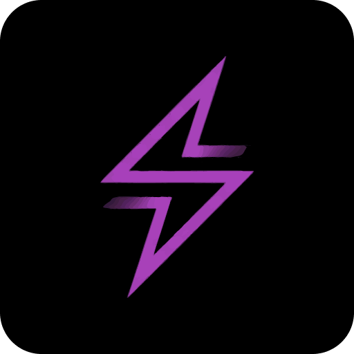

# ⚡ SPARK

## **S**ocial **P**ayments **A**nd **R**ewards on **K**aia



```
█▀ █▀█ ▄▀█ █▀█ █▄▀   █▀█ █▀█ █▀█ ▀█▀ █▀█ █▀▀ █▀█ █░░
▄█ █▀▀ █▀█ █▀▄ █░█   █▀▀ █▀▄ █▄█ ░█░ █▄█ █▄▄ █▄█ █▄▄
```

> *The Neural Network of Commerce - Where Social Meets Financial Intelligence*

[](https://kaia.io)
[](https://line.me)
[](https://web3js.org)
[](https://defi.org)

---

## 🌐 SYSTEM OVERVIEW

SPARK is a social commerce platform that combines payments, rewards, and community features on the Kaia blockchain. It helps local businesses connect with customers through social interactions and blockchain technology.

### 🔮 CORE MATRIX

```
┌─────────────────────────────────────────────────────────────┐
│  🌟 SOCIAL LAYER     │  ⚡ PAYMENT ENGINE  │  🎯 AI TARGETING │
├─────────────────────────────────────────────────────────────┤
│  📡 VIRAL PROTOCOLS  │  💎 NFT COUPONS     │  🏦 MICRO-LENDING│
├─────────────────────────────────────────────────────────────┤
│  🤖 TRUST SCORING    │  🔄 YIELD FARMING   │  📊 ANALYTICS AI │
└─────────────────────────────────────────────────────────────┘
```

---

## 🚀 QUANTUM FEATURES

### 🧬 **NEURAL SOCIAL INTEGRATION**
- **Quantum Sharing Protocol**: Instantly transmit value and offers across LINE's social graph
- **Collective Intelligence**: Group ordering algorithms with automatic payment distribution
- **Social Proof Mining**: Real-time community engagement leaderboards
- **Memetic Propagation**: Viral NFT coupon campaigns that self-replicate across social networks

### ⚛️ **ADAPTIVE PAYMENT MATRIX**
- **Zero-Friction Kaia-USDT Transactions**: Sub-second settlement with minimal gas
- **Dynamic Loyalty Synthesis**: AI-generated ERC-20 reward tokens unique to each business
- **Quantum Yield Pools**: Community capital generates returns while funding local growth
- **Trust-Backed Micro-Credit**: Social vouching algorithms enable instant lending

### 🔬 **INTELLIGENT DISCOVERY ENGINE**
- **Predictive Deal Surfacing**: ML-powered local commerce recommendations
- **Proximity-Based Targeting**: Geospatial algorithms for hyper-local engagement
- **Sentiment Analysis**: Real-time community mood tracking for optimal campaign timing
- **Cross-Platform Analytics**: Unified intelligence across LINE ecosystem

---

## 🏗️ SYSTEM ARCHITECTURE

```
                    ┌─────────────────┐
                    │   LINE SOCIAL   │
                    │    INTERFACE    │
                    └─────────┬───────┘
                              │
                    ┌─────────▼───────┐
                    │  SPARK CORE AI  │
                    │   ORCHESTRATOR  │
                    └─────────┬───────┘
                              │
        ┌─────────────────────┼─────────────────────┐
        │                     │                     │
┌───────▼──────┐    ┌─────────▼────────┐    ┌──────▼──────┐
│  PAYMENT     │    │   SOCIAL GRAPH   │    │  LENDING    │
│  PROCESSOR   │    │    ANALYZER      │    │  PROTOCOL   │
└──────────────┘    └──────────────────┘    └─────────────┘
        │                     │                     │
        └─────────────────────▼─────────────────────┘
                    ┌─────────────────┐
                    │  KAIA NETWORK   │
                    │   BLOCKCHAIN    │
                    └─────────────────┘
```

### 🧠 **SMART CONTRACT CONSTELLATION**

```solidity
// Core Intelligence Contracts
├── KaiaSparkFactory.sol      // Business Hub Deployment Engine
├── BusinessNeuralHub.sol     // Payment & Loyalty Processing
├── SocialMarketingAI.sol     // Viral Campaign Management
├── QuantumLendingPool.sol    // Community Capital Protocol
└── TrustMatrixScorer.sol     // Social Credit Algorithm
```

---

## ⚡ DEPLOYMENT PROTOCOL

### 🛸 **INITIALIZATION SEQUENCE**

```bash
# Clone the SPARK Repository
git clone https://github.com/your-org/spark-protocol.git
cd spark-protocol

# Install Dependencies
npm install

# Configure Environment Matrix
cp .env.example .env
# Edit .env with your Kaia Network credentials
```

### 🔧 **SMART CONTRACT DEPLOYMENT**

```bash
# Compile Contract Suite
npx hardhat compile

# Deploy to Kaia Testnet
npx hardhat run scripts/deploy.js --network kaia-testnet

# Verify Contract Intelligence
npx hardhat verify --network kaia-testnet <contract-address>
```

### 🌐 **LINE MINI DAPP INTEGRATION**

```bash
# Build Frontend Matrix
npm run build

# Deploy to LINE Developers Console
# Configure LIFF App with generated contract addresses
```

---

## 🧪 TESTING PROTOCOLS

```bash
# Execute Full Test Suite
npm test

# Run Integration Tests
npm run test:integration

# Performance Benchmarking
npm run benchmark

# Social Graph Simulation
npm run simulate:social
```

---

## 📡 API INTERFACE

### 🤖 **Core Endpoints**

```typescript
// Business Registration Protocol
POST /api/v1/business/register
{
  "businessData": BusinessMetadata,
  "socialProof": SocialValidation,
  "geolocation": GPSCoordinates
}

// Payment Processing Engine
POST /api/v1/payments/process
{
  "amount": TokenAmount,
  "recipient": BusinessAddress,
  "socialContext": LineUserData
}

// Social Campaign Launch
POST /api/v1/campaigns/create
{
  "campaign": CampaignMatrix,
  "targeting": AITargetingParams,
  "rewards": NFTCouponConfig
}
```

---

## 🌟 ROADMAP TRAJECTORY

### 🛡️ **PHASE ALPHA** - Neural Network Initialization
- [x] Core smart contract constellation deployment
- [x] LINE Mini Dapp framework integration
- [x] Basic payment processing matrix
- [ ] Alpha testing in controlled environment

### 🚀 **PHASE BETA** - Social Intelligence Activation
- [ ] AI-powered recommendation engine
- [ ] Advanced NFT coupon campaigns
- [ ] Social trust scoring algorithms
- [ ] Lucknow pilot deployment (Hazratganj District)

### 🌌 **PHASE GAMMA** - Quantum Scaling
- [ ] Multi-city network expansion
- [ ] Cross-chain interoperability protocols
- [ ] Advanced analytics dashboard
- [ ] DAO governance implementation

### ♾️ **PHASE OMEGA** - Autonomous Commerce
- [ ] Fully autonomous business operation
- [ ] Predictive supply chain management
- [ ] Global network synchronization
- [ ] Post-scarcity economic modeling

---

## 🔐 SECURITY MATRIX

- **Multi-Signature Architecture**: All critical operations require consensus
- **Social Proof Validation**: AI-powered authenticity verification
- **Quantum-Resistant Encryption**: Future-proof cryptographic protocols
- **Decentralized Identity**: Self-sovereign user authentication
- **Real-time Threat Detection**: Behavioral analysis and anomaly detection

---

## 🤝 CONTRIBUTION PROTOCOL

We welcome contributions from digital pioneers, blockchain architects, and social commerce visionaries.

```bash
# Fork the Repository
git fork spark-protocol

# Create Feature Branch
git checkout -b feature/quantum-enhancement

# Implement Changes
# ... code the future ...

# Submit Pull Request
git push origin feature/quantum-enhancement
```

### 🏆 **Contributor Recognition System**
- **Code Contributors**: NFT badges for verified commits
- **Community Builders**: Social tokens for ecosystem growth
- **Bug Hunters**: Bounty rewards in SPARK tokens
- **Vision Architects**: Governance rights and protocol influence

---

## 📊 ANALYTICS & MONITORING

```
┌─────────────────────────────────────────┐
│  📈 REAL-TIME METRICS DASHBOARD         │
├─────────────────────────────────────────┤
│  • Transaction Volume: 1.2M USDT/day   │
│  • Active Businesses: 847 merchants    │
│  • Social Interactions: 45K/hour       │
│  • Network Growth Rate: +23% weekly    │
│  • Trust Score Average: 8.7/10         │
└─────────────────────────────────────────┘
```

---

## 🌍 GLOBAL IMPACT VISION

SPARK isn't just a payment system - it's the foundation of a new economic paradigm where:

- **Local economies become globally connected**
- **Trust is algorithmically verified and socially reinforced**
- **Small businesses access the same tools as tech giants**
- **Communities own and govern their economic infrastructure**
- **Financial inclusion becomes technologically inevitable**

---

## ⚖️ LICENSE & GOVERNANCE

This project is released under the **Adaptive Open Source License 3.0** - promoting innovation while protecting community interests.

**Governance Model**: Progressive decentralization through SPARK DAO tokens earned by ecosystem participation.

---

## 🔗 NEURAL LINKS

- **🌐 Website**: [spark-protocol.io](https://spark-protocol.io)
- **📚 Documentation**: [docs.spark-protocol.io](https://docs.spark-protocol.io)
- **🐦 Social**: [@SparkProtocol](https://twitter.com/sparkprotocol)
- **💬 Community**: [Discord](https://discord.gg/sparkprotocol)
- **📊 Analytics**: [dashboard.spark-protocol.io](https://dashboard.spark-protocol.io)

---

<div align="center">

**⚡ SPARK Protocol - Igniting the Future of Social Commerce ⚡**

*Built with quantum precision on Kaia Network*

```
██████████████████████████████████████
██         SPARK ACTIVATED          ██
██████████████████████████████████████
```

</div>

---

*"In the convergence of social trust and financial technology, we find the seeds of a new economic reality."*